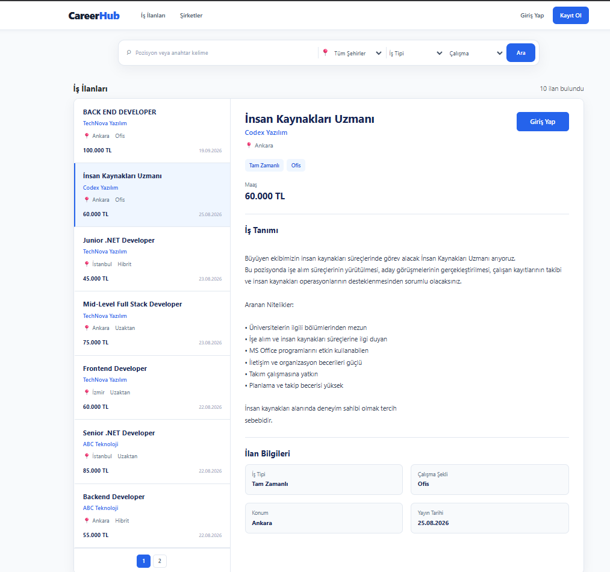
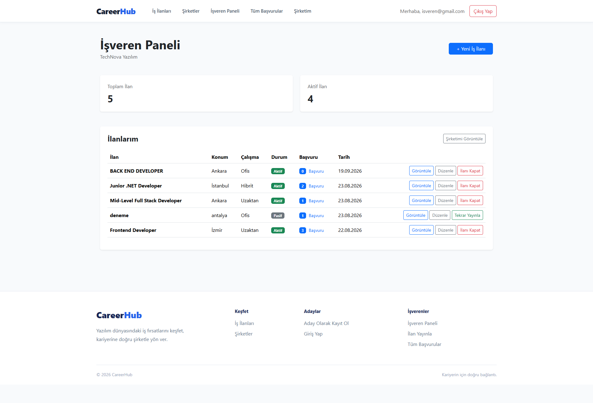
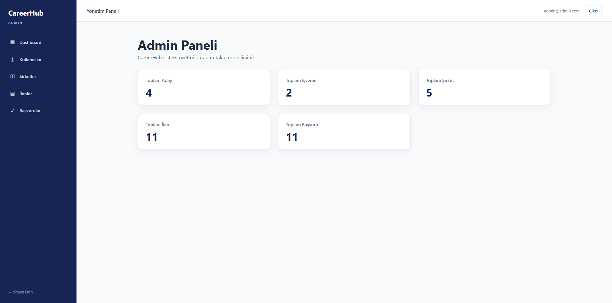

<div align="center">

# 💼 CareerHub

### Yazılım dünyasında adayları ve işverenleri bir araya getiren modern iş ilanı platformu.

CareerHub; adayların iş ilanlarını keşfedebildiği, CV ile başvuru yapabildiği,  
işverenlerin ilanlarını ve başvurularını yönetebildiği  
**ASP.NET Core MVC tabanlı bir iş ilanı platformudur.**

<br>


</div>

---

## 🚀 Proje Hakkında

**CareerHub**, yazılım sektörüne yönelik iş ilanlarının yayınlanabildiği ve adayların bu ilanlara başvuru yapabildiği bir web uygulamasıdır.

Projede üç farklı kullanıcı rolü bulunmaktadır:

👨‍💻 **Candidate** → İş arayan adaylar  
🏢 **Employer** → İşverenler  
🛡️ **Admin** → Platform yöneticileri  

Her rolün kendine ait yetkileri ve ekranları bulunmaktadır.

---

# ✨ Öne Çıkan Özellikler

## 👨‍💻 Aday Paneli

- 🔐 Kayıt olma ve giriş yapma
- 👤 Profil bilgilerini düzenleme
- 🖼️ Profil fotoğrafı yükleme
- 📄 PDF formatında CV yükleme
- 🔎 İş ilanlarında arama yapma
- 📍 Şehre göre filtreleme
- 💼 İş tipine göre filtreleme
- 🏠 Ofis / Hibrit / Uzaktan filtreleme
- 📩 İş ilanlarına başvuru yapma
- 📋 Yapılan başvuruları görüntüleme
- 🔄 Başvuru durumlarını takip etme
- 🏢 Şirket profillerini görüntüleme

---

## 🏢 İşveren Paneli

- 🏢 Şirket profili oluşturma
- ✏️ Şirket bilgilerini düzenleme
- ➕ Yeni iş ilanı yayınlama
- 📝 İş ilanlarını düzenleme
- 🟢 / 🔴 İlanları aktif veya pasif hale getirme
- 🔢 İlan bazında başvuru sayılarını görüntüleme
- 👥 Belirli bir ilana başvuran adayları listeleme
- 👤 Aday detaylarını görüntüleme
- 📄 Aday CV'sini görüntüleme
- 🔄 Başvuru durumunu güncelleme
- 📊 Tüm başvuruları tek ekrandan yönetme

Başvuru durumları:

```text
🟡 Bekliyor
🔵 İncelendi
🟣 Görüşme
🟢 Kabul Edildi
🔴 Reddedildi
```

---

## 🛡️ Admin Paneli

- 📊 Admin Dashboard
- 👥 Kullanıcıları görüntüleme
- 🔍 Kullanıcı detaylarını inceleme
- 🔒 Kullanıcı hesaplarını kilitleme
- 🔓 Kullanıcı kilidini kaldırma
- 🏢 Şirketleri görüntüleme
- 💼 İş ilanlarını yönetme
- 🟢 / 🔴 İlan durumlarını değiştirme
- 📩 Sistemdeki başvuruları görüntüleme

---

# 🔎 İş İlanı Deneyimi

CareerHub'ın iş ilanları ekranı masaüstünde **Split View** yapısına sahiptir.

```text
┌────────────────────────┬───────────────────────────────┐
│                        │                               │
│     İlan Listesi       │       İlan Detayı            │
│                        │                               │
│  Backend Developer     │  Backend Developer            │
│  Gökalp Yazılım        │  Gökalp Yazılım              │
│  Ankara · Uzaktan      │                               │
│                        │  İş Tanımı                    │
│  Frontend Developer    │  ...                          │
│  ABC Teknoloji         │                               │
│                        │  [ Başvur ]                   │
│       1  2  3          │                               │
└────────────────────────┴───────────────────────────────┘
```

🖥️ Masaüstünde kullanıcı soldaki ilanlardan seçim yaparak sağ tarafta detayları görüntüleyebilir.

📱 Mobil cihazlarda ise ilan seçildiğinde ayrı ilan detay sayfası açılır.

---

# 🔍 Arama ve Filtreleme

Kullanıcılar ilanları aşağıdaki kriterlere göre filtreleyebilir:

🔎 Pozisyon / anahtar kelime  
📍 Şehir  
💼 İş tipi  
🏠 Çalışma şekli  

Ayrıca ilanlar **pagination** sistemiyle sayfalanmaktadır.

---

# 📩 Başvuru Sistemi

Adayların bir ilana başvurabilmesi için sistemde bir CV'sinin bulunması gerekir.

Bir aday aynı ilana yalnızca **bir kez** başvurabilir.

```text
Aday
  │
  ▼
İlanı Görüntüler
  │
  ▼
CV Kontrolü
  │
  ▼
Başvuru Oluşturulur
  │
  ▼
İşveren Başvuruyu Görür
  │
  ▼
Durum Güncellenir
```

---

# 🔐 Authentication & Authorization

Projede **ASP.NET Core Identity** kullanılmaktadır.

### Roller

| Rol | Açıklama |
|---|---|
| 👨‍💻 `Candidate` | İş ilanlarına başvurabilir |
| 🏢 `Employer` | Şirket ve ilanlarını yönetebilir |
| 🛡️ `Admin` | Sistemi yönetebilir |

Public kayıt ekranından yalnızca:

```text
Candidate
Employer
```

rolleri oluşturulabilir.

🚫 Kullanıcı formu manipüle ederek kendisine `Admin` rolü veremez.

---

# 🛡️ Güvenlik Önlemleri

Projede çeşitli güvenlik kontrolleri uygulanmıştır.

✅ Role Based Authorization  
✅ ASP.NET Core Identity  
✅ Anti-Forgery Token  
✅ Ownership kontrolleri  
✅ Güvenli `returnUrl` kontrolü  
✅ Admin rolünün public kayıt üzerinden engellenmesi  
✅ Aynı ilana tekrar başvurmanın engellenmesi  
✅ CV dosya boyutu kontrolü  
✅ CV dosya türü kontrolü  
✅ Profil fotoğrafı uzantı kontrolü  
✅ Profil fotoğrafı dosya imzası kontrolü  
✅ GUID tabanlı dosya isimlendirme  
✅ İşverenin yalnızca kendi ilanlarını yönetebilmesi  
✅ İşverenin yalnızca kendi ilanlarına yapılan başvuruları görebilmesi  
✅ Özel 403 / 404 / 500 hata sayfaları  

---

# 🗄️ Veritabanı

Projede **PostgreSQL** kullanılmaktadır.

Veritabanı işlemleri **Entity Framework Core** üzerinden gerçekleştirilmektedir.

Başlıca tablolar:

```text
AspNetUsers
AspNetRoles
AspNetUserRoles

companies
job_postings
job_applications
```

---

## 🔗 Temel Veritabanı İlişkileri

```text
                  ApplicationUser
                  /             \
                 /               \
          Employer               Candidate
             │                       │
             │                       │
             ▼                       │
          Company                    │
             │                       │
             │ 1 - N                 │
             ▼                       │
        JobPosting                   │
             │                       │
             │ 1 - N                 │
             ▼                       │
        JobApplication ◄─────────────┘
```

---

# 🧰 Kullanılan Teknolojiler

| Teknoloji | Kullanım |
|---|---|
| ⚙️ ASP.NET Core MVC | Web uygulama mimarisi |
| 💜 C# | Backend geliştirme |
| 🐘 PostgreSQL | Veritabanı |
| 🔗 Entity Framework Core | ORM |
| 🔐 ASP.NET Core Identity | Authentication & Authorization |
| 🧠 LINQ | Veritabanı sorguları |
| 📄 Razor Views | UI oluşturma |
| 🎨 Bootstrap | Responsive tasarım |
| 🖌️ CSS | Özel tasarım |
| ⚡ JavaScript | Frontend etkileşimleri |

---

# 🏗️ Proje Yapısı

```text
CareerHub
│
├── 📁 Areas
│   └── 📁 Admin
│       ├── Controllers
│       ├── ViewModels
│       └── Views
│
├── 📁 Controllers
│
├── 📁 Data
│
├── 📁 Helpers
│
├── 📁 Models
│
├── 📁 ViewModels
│
├── 📁 Views
│
├── 📁 wwwroot
│
├── 📁 Migrations
│
├── ⚙️ Program.cs
│
└── ⚙️ appsettings.json
```

---

# 📸 Ekran Görüntüleri

## 💼 İş İlanları

<p align="center">
  
</p>

---

## 🏢 İşveren Paneli

<p align="center">
  
</p>

---

## 📩 Gelen Başvurular

<p align="center">
  
</p>

---

## 🛡️ Admin Paneli

<p align="center">
  
</p>
---

# ⚙️ Kurulum

### 1️⃣ Repository'yi klonlayın

```bash
git clone https://github.com/KULLANICI-ADIN/CareerHub.git
```

### 2️⃣ Proje klasörüne girin

```bash
cd CareerHub
```

### 3️⃣ PostgreSQL veritabanı oluşturun

Örneğin:

```text
careerhubdb
```

### 4️⃣ Connection String'i yapılandırın

```json
{
  "ConnectionStrings": {
    "DefaultConnection": "Host=localhost;Port=5432;Database=careerhubdb;Username=postgres;Password=YOUR_PASSWORD"
  }
}
```

> ⚠️ Gerçek veritabanı şifrenizi GitHub repository'sine göndermeyin.

Development ortamında **User Secrets** veya environment variables kullanılması önerilir.

### 5️⃣ Migration'ları uygulayın

```bash
dotnet ef database update
```

### 6️⃣ Projeyi çalıştırın

```bash
dotnet run
```

🎉 CareerHub artık çalışmaya hazır.

---

# 📚 Bu Projede Neler Öğrendim?

Bu proje geliştirilirken birçok ASP.NET Core konusu uygulamalı olarak kullanılmıştır:

🎯 ASP.NET Core MVC mimarisi  
🎯 Controller / Model / View ilişkisi  
🎯 Routing  
🎯 Dependency Injection  
🎯 PostgreSQL kullanımı  
🎯 Entity Framework Core  
🎯 Migration sistemi  
🎯 LINQ sorguları  
🎯 One-to-One ilişkiler  
🎯 One-to-Many ilişkiler  
🎯 Async database işlemleri  
🎯 ASP.NET Core Identity  
🎯 Authentication  
🎯 Authorization  
🎯 Role Based Authorization  
🎯 ViewModel kullanımı  
🎯 Dosya yükleme işlemleri  
🎯 Server-side validation  
🎯 Responsive tasarım  
🎯 Güvenli backend geliştirme  

---

# 🔮 Gelecekte Eklenebilecek Özellikler

CareerHub'ın mevcut kapsamı tamamlanmış olsa da ileride aşağıdaki özellikler geliştirilebilir:

⭐ İş ilanlarını favorilere ekleme  
📧 E-posta doğrulama  
🔑 Şifre sıfırlama  
🔔 Bildirim sistemi  
🏢 Şirket logosu yükleme  
📨 Başvuru bildirimleri  
🔍 Gelişmiş arama ve sıralama  
📊 İşveren istatistikleri  
📄 Başvuru sırasında CV snapshot sistemi  

---

# 🎯 Projenin Amacı

CareerHub, gerçek bir iş ilanı platformunda bulunabilecek temel süreçleri uygulayarak;

> **ASP.NET Core MVC, PostgreSQL, Entity Framework Core ve Identity konularında pratik yapmak amacıyla geliştirilmiştir.**

Proje aynı zamanda backend geliştirme, rol bazlı yetkilendirme ve ilişkisel veritabanı tasarımı konularında deneyim kazanmayı hedeflemektedir.

---

# 👨‍💻 Geliştirici

<div align="center">

### Abdullah Gökalp

💻 Backend Development  
⚙️ ASP.NET Core MVC  
🐘 PostgreSQL  

<br>

⭐ Projeyi beğendiyseniz repository'ye yıldız bırakabilirsiniz.

</div>

---

<div align="center">

### 💼 CareerHub

**Doğru yetenek. Doğru şirket. Doğru kariyer.**

</div>
